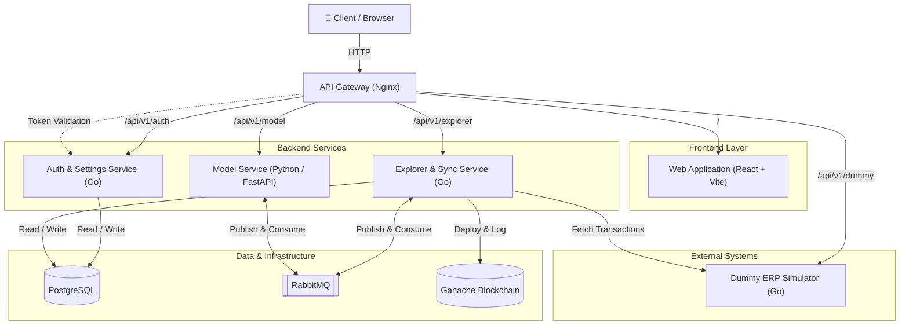

# TrustChain Implementation

TrustChain adalah platform sistem informasi terintegrasi berbasis blockchain yang dirancang untuk menarik (*pull*), memvalidasi, mencatat transaksi/log dari sistem *Enterprise Resource Planning* (ERP) milik klien ke dalam buku besar (*ledger*) yang transparan dan dapat diverifikasi, dengan dukungan deteksi *fraud* menggunakan AI/Machine Learning.

## 🏗 Arsitektur Sistem

Berikut adalah diagram desain sistem (*System Architecture*) untuk TrustChain:



Sistem ini dibangun menggunakan arsitektur *Microservices* yang diorkestrasi melalui Docker Compose, dengan komponen-komponen utama sebagai berikut:

### 1. API Gateway (Nginx)
Berperan sebagai *Reverse Proxy* dan pintu masuk utama (*entry point*) untuk seluruh *traffic* eksternal. Nginx juga memvalidasi setiap token akses secara terpusat dengan memanfaatkan modul `auth_request` ke Auth Service. Seluruh layanan dapat diakses melalui satu domain/port secara aman.

### 2. Frontend Aplikasi (`/frontend`)
Aplikasi web *Single Page Application* (SPA) interaktif.
- **Tech Stack**: React 19, TypeScript, Vite, TailwindCSS v4, React Router, dan React Query.
- **Fitur Utama**: Dashboard pengguna, manajemen *settings* integrasi ERP, dan tampilan antarmuka Blockchain Explorer untuk melacak blok dan transaksi secara *real-time*, serta manajemen peringatan *fraud* (*Cases*).

### 3. Layanan Backend (`/backend`)
Dibangun dengan pendekatan *Microservices* menggunakan **Go (Golang)**, **Python**, dan infrastruktur pendukung:
- **Auth Service**: Menangani proses otentikasi (JWT), manajemen akun pengguna, pengaturan ERP klien, dan verifikasi token internal.
- **Model Service (Python/FastAPI)**: Layanan Machine Learning untuk mendeteksi anomali/fraud pada transaksi menggunakan metode Ensemble (Isolation Forest + LSTM).
- **Explorer Service (Go)**: Mengelola sinkronisasi data dari ERP klien (melalui *Background Worker* otomatis), mengirimkan data ke AI, mencatat transaksi ke *smart contract* blockchain, dan menyediakan API pencarian transaksi/blok.
- **Dummy API (Go)**: Simulator sistem ERP eksternal (*mock*) untuk pengujian integrasi. Secara otomatis menghasilkan 90% transaksi normal dan 10% pola *fraud*.
- **Database (PostgreSQL 15)**: Penyimpanan data profil dan konfigurasi klien.

### 4. Infrastruktur Asinkron & Jaringan Ledger
- **Message Broker (RabbitMQ)**: Menangani komunikasi antar-layanan (*microservices*) secara asinkron. Mengatur antrean sinkronisasi (*sync_jobs*) dan distribusi data ke AI (*predict_requests* & *predict_responses*).
- **Blockchain Node (Ganache)**: *Local blockchain network* yang menjalankan Ethereum Virtual Machine (EVM) untuk men-deploy *smart contract* `TrustChain.sol` secara otomatis saat sistem dimulai.

---

## 🚀 Cara Menjalankan (*Quick Start*)

Pastikan Anda telah menginstal [Docker](https://www.docker.com/) dan [Docker Compose](https://docs.docker.com/compose/) di mesin Anda.

1. **Jalankan Seluruh Layanan**
   Jalankan perintah berikut di *root directory* proyek:
   ```bash
   docker-compose up --build -d
   ```
   *Perintah ini akan menjalankan container untuk Nginx, Auth Service, Model Service, Explorer Service, Dummy API, Frontend, RabbitMQ, PostgreSQL, dan Ganache secara otomatis.*

2. **Akses Layanan via API Gateway**
   - **Aplikasi Frontend**: Biasanya tersedia di `http://localhost:5173`
   - **API Gateway Utama**: `http://localhost:8080/api/v1/`
   - **Dummy API (Simulator ERP)**: `http://localhost:8080/api/v1/dummy/` *(Dapat diakses langsung via browser/Postman tanpa memutar port ekstra)*

---

## 📚 Struktur Direktori & Dokumentasi API

Untuk detail lebih lanjut mengenai masing-masing komponen, Anda dapat membaca spesifikasi *API Contract* dan dokumentasi implementasinya di folder masing-masing:

- `nginx/spec.md`: Spesifikasi dan cara kerja API Gateway.
- `backend/auth_service/spec.md`: Spesifikasi API Auth & Settings.
- `backend/explorer_service/spec.md`: Spesifikasi API Blockchain Explorer & Background Data Sync Worker.
- `frontend/implementation.md`: Rancangan arsitektur dan UI untuk implementasi fitur Blockchain Explorer di Frontend.

---

## 🛠 Konfigurasi Lingkungan (*Environment*) & Panduan
- **Konfigurasi Environment**: Diatur melalui file `.env` di masing-masing service (misal: `frontend/.env`).
- **Sinkronisasi Data Tidak Berjalan**: Jika Anda melihat sistem tidak menarik transaksi, pastikan Anda telah memasukkan *endpoint* ERP (misal `http://dummy_api:8080/predict`) ke dalam form **Settings** di halaman aplikasi agar *Background Worker* mulai menyala.
